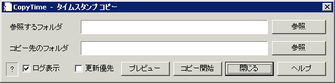

##  CopyTime ファイルタイムスタンプ（日時）コピー for Windows<!-- omit in toc -->

---
[Home](https://oasis3855.github.io/webpage/) > [Software](https://oasis3855.github.io/webpage/software/index.html) > [Software Download](https://oasis3855.github.io/webpage/software/software-download.html) > [copytimestamp](../ddisk/README.md) > ***copytimestamp*** (this page)

 
 

Last Updated : May. 2002

- [ソフトウエアのダウンロード](#ソフトウエアのダウンロード)
- [機能の概要](#機能の概要)
- [動作環境](#動作環境)
- [バージョンアップ履歴](#バージョンアップ履歴)
- [主な掲載雑誌](#主な掲載雑誌)
- [ライセンス](#ライセンス)

 
 

## ソフトウエアのダウンロード

-    [このGitHubリポジトリを参照する](../copytimestamp/download) 

-    [GoogleDriveを参照する](https://drive.google.com/drive/folders/0B7BSijZJ2TAHMzgxMzVhMTktZGM4Yi00YzdkLTllYTEtZDc5ZDc3MzU2ZDg5?resourcekey=0-9QMYmEY8DxXdWKqeq2goEQ)

 
 

## 機能の概要

コピー元からコピー先へ、同一名称ファイルのタイムスタンプ（作成・更新日時）をコピーするソフトウエア

コピー対象は”作成日時”と”最終更新日時”の2種類ですが、画面の都合上、プレビュー表示などでは”最終更新日時”だけを表示しています。指定したフォルダ直下にあるファイルのみを対象にします。サブフォルダは対象外です。

 
 

## 動作環境

- Windows 95/98/Me/NT/2000/XP/Vista/7 

 
 

## バージョンアップ履歴

- Version 1.0 (2000/10/13)

  - 公開開始 

- Version 1.01 (2000/10/26)

  - レジストリに前回のフォルダ情報を保存するモードを新設 

- Version 1.1 (2002/05/20)

  - 英語リソースの挿入 
  - 作成日時」も処理対象に加える 

 
 

## 主な掲載雑誌

- ウインドウズ・パワー（アスキー） 
- テックウィン (アスキー) 
- インターネットスタート・ウインドウズＲｏｍ！（毎日コミュニケーションズ） 

 
 

## ライセンス

このソフトウエアは [GNU General Public License v3ライセンスで公開する](https://gpl.mhatta.org/gpl.ja.html) フリーソフトウエア

