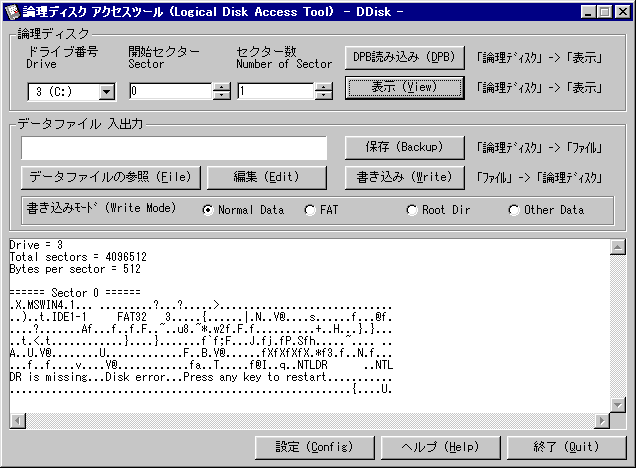

##  論理ディスク アクセスツール for Windows 95/98<!-- omit in toc -->

---
[Home](https://oasis3855.github.io/webpage/) > [Software](https://oasis3855.github.io/webpage/software/index.html) > [Software Download](https://oasis3855.github.io/webpage/software/software-download.html) > [ddisk](../ddisk/README.md) > ***ddisk*** (this page)

 
 

Last Updated : May. 2002

- [ソフトウエアのダウンロード](#ソフトウエアのダウンロード)
- [機能の概要](#機能の概要)
  - [高度な技術的解説](#高度な技術的解説)
  - [制限事項](#制限事項)
- [動作環境](#動作環境)
- [バージョンアップ履歴](#バージョンアップ履歴)
- [主な掲載雑誌](#主な掲載雑誌)
- [ライセンス](#ライセンス)

 
 

## ソフトウエアのダウンロード

-    [このGitHubリポジトリを参照する](../ddisk/download) 

-    [GoogleDriveを参照する]([../ddisk/download](https://drive.google.com/drive/folders/0B7BSijZJ2TAHNGFmY2JkMWQtNDU0Mi00YzQwLTliMWQtYTI0NzVhMjMzMWZl?resourcekey=0-aHbUaxaTOWFmxqu2rjz_QQ)) 

 
 

## 機能の概要

Windows98標準機能で、唯一欠落していたディスクエディタ。このソフトウエアを使用することで、論理ディスクの指定セクタに対して読み出し・書き込みを行うことができるようになります。（データ編集作業には、別途バイナリーエディタを入手してください。）

ブート ローダの書き換え、バックアップ。ディレクトリ・エントリやFATを書き換えることによる削除ファイルの復活。ハードディスク内の解析など。様々な目的に使えるかもしれません。

このソフトウエアで可能なこと

- 論理ディスクのDPBを表示
- 特定のセクターにあるデータをファイルに複写（保存）
- ファイルの内容を特定セクターに複写（書き込み） 

### 高度な技術的解説

このプログラムは、DOSのINT21Hを使用します。（Windows95製品版では INT25H,26H）

書き込み時のみ、レベル１の書込み保護ロックをドライブ全体にかけます。ロックをかけることができない場合は論理ディスクへの書き込みはできません。 

各種ディスクユーティリティーとは相性が悪いと思われますので、動作に注意してください。 

データファイルへの書き込み・読み出しは１クラスタごとに行われます。複数のクラスタを指定した場合は、ディスクアクセスに時間がかかるかもしれません。（本ソフト内にはキャッシュを持っていませんが、Windowsのキャッシュ機構が働きますので、バッファリングはされるはずですが…） 

### 制限事項

- １クラスタの大きさが4096バイト以上のディスクで使用不可。 
- マルチユーザー環境で、管理者以外がアンインストールした場合の不具合あり。 
- Windows95製品版の認識を自動で行わない。 
- 32kBytes以上のプレビューができない。 
- DOSの認識限界を超えた深いフォルダへのセーブ・ロードが失敗する。 

 
 

## 動作環境

- Windows 95/98/Me (日本語版および各国語版)
- Windows NT/2000/XP/Vista/7 では利用不可（Microsoftから無償配布されているDisk Probeをご利用ください） 

 
 

## バージョンアップ履歴

- Version 0.5 (2000/02/17)

  - 公開開始 

- Version 0.6 (2002/05/20)

  - インストーラ・アンインストーラの変更 
  - 英語リソースの挿入 
  - Windows NT/2000/XP に間違ってインストールした場合のアンインストールのサポート 

 
 

## 主な掲載雑誌

- PC JAPAN （ソフトバンク） 
- DOS/V Magazine （ソフトバンク） 
- DOS/V Power Report (インプレス) 
- Oh PC （ソフトバンク） 
- テックウイン （アスキー） 
- ウインドウズ・パワー（アスキー） 
- インターネットスタート・ウインドウズＲｏｍ！（毎日- コミュニケーションズ） 
- PC Japan (ソフトバンク) 

 
 

## ライセンス

このソフトウエアは [GNU General Public License v3ライセンスで公開する](https://gpl.mhatta.org/gpl.ja.html) フリーソフトウエア
