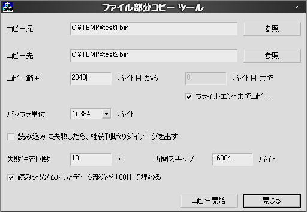

## FileCopyEx ファイル部分コピーツール for Windows<!-- omit in toc -->

---
[Home](https://oasis3855.github.io/webpage/) > [Software](https://oasis3855.github.io/webpage/software/index.html) > [Software Download](https://oasis3855.github.io/webpage/software/software-download.html) > [filecopyex](../filecopyex/README.md) > ***filecopyex*** (this page)

 
 

Last Updated : May. 2002

- [ソフトウエアのダウンロード](#ソフトウエアのダウンロード)
- [機能の概要](#機能の概要)
- [動作環境](#動作環境)
- [バージョンアップ履歴](#バージョンアップ履歴)
- [ライセンス](#ライセンス)

 
 

## ソフトウエアのダウンロード

-    [このGitHubリポジトリを参照する](../filecopyex/download) 

 
 

## 機能の概要

***このソフトウエアは個人的にプログラム開発時に利用したものです***

ファイルの一部分をコピーするためのツール。コピー開始・終了のファイルでの位置をファイル先頭からのバイト単位で指定できます。エラーが発生した場合に終了するか、読み飛ばすかの指定も出来ます。ソフトウエア作成時に、テスト用のファイルを作成する目的で作成されています。 

 
 

## 動作環境

- Windows 95/98/98SE/Me/2000/XP/Vista 等
- MFC42.DLL および MSVCRT.DLL がシステムフォルダに存在すること

 
 

## バージョンアップ履歴

- Version 1.0 (2002/05/11)

 
 

## ライセンス

このソフトウエアは [GNU General Public License v3ライセンスで公開する](https://gpl.mhatta.org/gpl.ja.html) フリーソフトウエア
