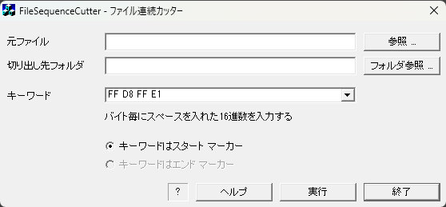

## FileSequenceCutter ファイル連続カッター for Windows<!-- omit in toc -->

---
[Home](https://oasis3855.github.io/webpage/) > [Software](https://oasis3855.github.io/webpage/software/index.html) > [Software Download](https://oasis3855.github.io/webpage/software/software-download.html) > [filesequencecutter](../filesequencecutter/README.md) > ***filesequencecutter*** (this page)

 
 

Last Updated : Oct. 2004

- [ソフトウエアのダウンロード](#ソフトウエアのダウンロード)
- [機能の概要](#機能の概要)
  - [切り出しイメージ](#切り出しイメージ)
- [動作環境](#動作環境)
  - [動作確認](#動作確認)
- [バージョンアップ履歴](#バージョンアップ履歴)
- [ライセンス](#ライセンス)

 
 

## ソフトウエアのダウンロード

-    [このGitHubリポジトリを参照する](../filesequencecutter/download) 

 
 

## 機能の概要

バイナリファイルより、指定した16進数Magic Numberで区切って、連番ファイルとして切り出すツール。

破損し読み込み出来なくなったデジタルカメラのメモリーカードから、画像ファイルを抽出し書き出すために作成したテストツールです。

- [デジタルカメラ用メモリーからの画像の救出（復旧）](./RescueJpegFile.md)

**取り扱えるファイルの最大サイズは、C++のファイルポインタがlong変数の範囲で、およそ2,147,483,647 Bytesまで。**

- 元ファイル ： 切り出し元のデータファイルを指定します

- 切り出し先フォルダ ： 切り出したデータを出力するフォルダを指定します 
（フォルダ内には他のファイルが存在しないのが好ましい）

- キーワード ： 16進数8バイトのバイト列を記入します
    - 例）JPEG/EXIFファイルを切り出すときは、そのMagic Number「FF D8 FF E1」を指定します 
    16進数を直接記入しても、0x00のように C言語スタイルでも、00Hのようにアセンブラスタイルでも記入できます。文字の間はスペースで区切ってください

必要な設定が終われば、「実行」ボタンを押します。640MBytes程度のファイルなら、約2〜3分程度で処理が終了します。

### 切り出しイメージ

jpeg/exifファイルのMagic Number「FF D8 FF E1」を指定した場合の、ファイル切り出しイメージ

 
 

## 動作環境

- Windows 95/98/98SE/Me/2000/XP 等
- MFC42.DLL および MSVCRT.DLL がシステムフォルダに存在すること

### 動作確認
  - Windows 11で動作確認済み（2024/04/04現在）

 
 

## バージョンアップ履歴

- Version 0.1 (2004/10/11)

 
 

## ライセンス

このソフトウエアは [GNU General Public License v3ライセンスで公開する](https://gpl.mhatta.org/gpl.ja.html) フリーソフトウエア
