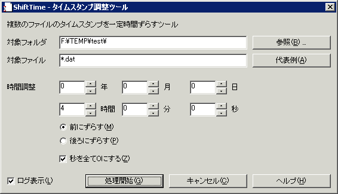

##  ShiftTime ファイル日時の一括補正 for Windows<!-- omit in toc -->

---
[Home](https://oasis3855.github.io/webpage/) > [Software](https://oasis3855.github.io/webpage/software/index.html) > [Software Download](https://oasis3855.github.io/webpage/software/software-download.html) > [shifttimestamp](../ddisk/README.md) > ***shifttimestamp*** (this page)

<br />
<br />

Last Updated : May. 2002

- [ソフトウエアのダウンロード](#ソフトウエアのダウンロード)
- [機能の概要](#機能の概要)
- [動作環境](#動作環境)
- [バージョンアップ履歴](#バージョンアップ履歴)
- [主な掲載雑誌](#主な掲載雑誌)
- [ライセンス](#ライセンス)

<br />
<br />

## ソフトウエアのダウンロード

-    [このGitHubリポジトリを参照する](../shifttimestamp/download) 

-    [GoogleDriveを参照する](https://drive.google.com/drive/folders/0B7BSijZJ2TAHNzgwNmRiN2YtY2YxYy00OWMwLWFlNzMtOTBhZDgxNzI1YTY1?resourcekey=0-k1Lp-ppPGMgmtOrJXtJZUA)

<br />
<br />

## 機能の概要

ファイルのタイムスタンプ（作成・更新日時）を、”指定した時間”だけ一括してずらすソフトウエア。時差設定せずに海外で撮影した写真データなどで使われることを想定しています



このプログラムは、対象ファイルに対し次の操作をしています。ファイルの作成日時と最終更新日時を対象としています。

```C++
CFile::GetStatus(szTmp2, Fstatus); // 属性を取得し
Fstatus.m_mtime += tmShift; // 時差を代入して計算
Fstatus.m_ctime += tmShift; // 時差を代入して計算
CFile::SetStatus(szTmp2, Fstatus); // 属性を書き込む
```

なお、時差の表現は次のような計算で行っています

```C++
CTimeSpan tmShift(nYear*365 + nMonth*30 + nDay, nHour, nMin, nSec);
```

<br />
<br />

## 動作環境

- Windows 95/98/Me/NT/2000/XP/Vista/7 

<br />
<br />

## バージョンアップ履歴

- Version 1.0 (2002/03/20)

  - 公開開始 

- Version 1.1 (2002/05/20)

  - 英語リソースの挿入 ほか 

<br />
<br />

## 主な掲載雑誌

- 朝日新聞 土曜版 （朝日新聞） 
- アスキー ダッシュ （アスキー） 
- Windows Power （エンターブレイン） 

<br />
<br />

## ライセンス

このソフトウエアは [GNU General Public License v3ライセンスで公開する](https://gpl.mhatta.org/gpl.ja.html) フリーソフトウエア
